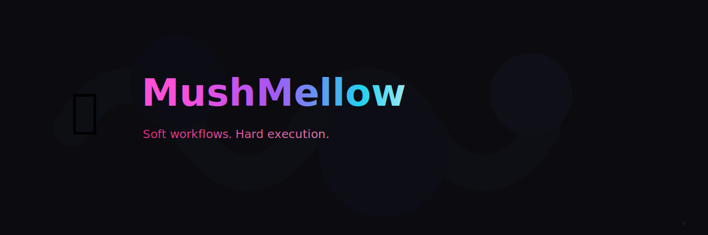

<p align="center">
  <a href="https://github.com/dominionthedev/mushmellow">
    
  </a>
</p>

<p align="center">
  <a href="https://github.com/dominionthedev/mushmellow/releases">
    
  </a>
  <a href="https//github.com/dominionthedev/mushmellow/actions">
    
  </a>
  <a href="./LICENSE">
    
  </a>
</p>

---

**Soft workflows. Hard execution.**

Mushmellow is a lightweight, stylish developer workflow runtime. It allows you to define and execute structured developer flows called **mushmellows**, composed of dependency-aware units called **puffs**.

## Why Mushmellow?

- **Readable**: YAML-based configuration that anyone can understand.
- **Portable**: Run the same workflows locally and in CI.
- **Composable**: Supports multi-file configurations via `*.mushmellow.yaml` discovery.
- **Aesthetic**: Styled output using Lipgloss for a "soft" developer experience. ✨
- **Smart**: Dependency-aware execution with a Directed Acyclic Graph (DAG).
- **Local-first**: Designed for developers, by developers.

## Installation

### From Source
```bash
go build -o /usr/local/bin/mushmellow .
```

### Via Go
```bash
go install github.com/dominionthedev/mushmellow@latest
```

## Core Concepts

### 🍡 Mushmellow
A named workflow (e.g., `build`, `test`, `release`).

### ☁️ Puff
The atomic execution unit. A puff can run commands, display messages, or wait. Puffs can depend on other puffs, forming an execution graph.

## Quick Start

Mushmellow automatically discovers `mushmellow.yaml` or any `*.mushmellow.yaml` in your current directory.

Create a `dev.mushmellow.yaml`:

```yaml
version: 1
name: My Project

mushmellows:
  dev:
    description: My dev workflow
    puffs:
      - id: hello
        type: message
        text: "Starting dev flow..."
      - id: check
        run: "go version"
      - id: build
        depends_on: [check]
        run: "go build ."
```

Run it:

```bash
mushmellow run dev
```

## CLI Commands

- `run <name>`: Execute a workflow.
- `list`: List all available workflows.
- `new <name>`: Scaffold a new workflow file.
- `puff`: Manage puffs via CLI.
- `doctor`: Validate your configuration.
- `edit`: Open configuration in your default editor.

## License

This project is licensed under the MIT License.

---

<br/>

<p align="center">
DominionDev
<a href="https://github.com/dominionthedev">GitHub</a> • <a href="https://dominionthedev.github.io">Website</a>
</p>

<p align="center">
  <a href="https://dominionthedev.github.io">
    
  </a>
</p>
